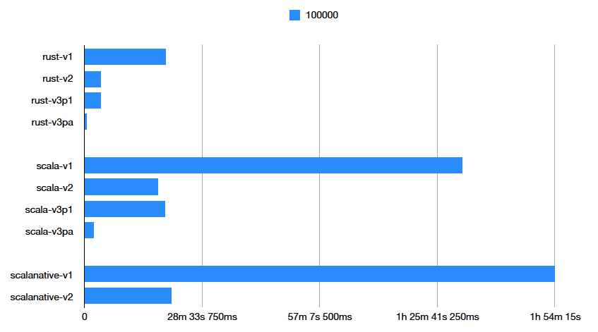
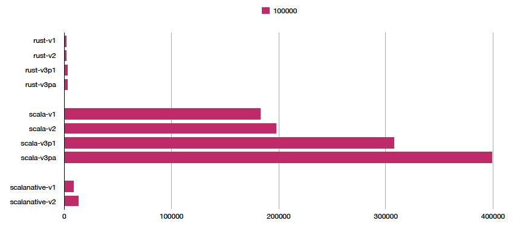

# Sudoku

By chance, I watched a YouTube video on backtracking [https://www.youtube.com/watch?v=G_UYXzGuqvM] (Python Sudoku Solver - Computerphile).
I decided it would be a nice toy project to develop it in my favorite programming language **Scala**, 
and **compare the code, performance and memory usage** afterwards with another programming language I would like to learn, **Rust**.

It was actually **NOT** my goal to develop the fastest Sudoku solver possible (!), 
rather than comparing these two programming languages **myself**.
I will improve the performance 'maybe' in a later version 0.2. There are lots of possibilities. 

My approach was:

* I developed a Scala version first. I did not use any third party libraries. I didn't think about JVM specific performance bottlenecks like 'array 2ds are slow'.
* Afterwards I developed a version in Rust. Since this is my first Rust program the code may look a bit awkward to Rust developers, I apologize. My only source to learn Rust was Google. I tried to copy the Scala code as much as possible. There is for every method / test in the Scala code a corresponding method / test in the Rust code.   
* I measured the performance (wall time, peak memory) with a unix tool **/usr/bin/time** (note, it is **NOT** the shell 'time' command).

## Build:

To easily try it yourself. I added a Docker-build file to the project:

```bash
docker build . --tag sudoku:0.5
```

This Docker build will:

* Download QQWing from [https://qqwing.com] for generating Sudoku puzzles. It's a very fast Sudoku solver (and generator) using a more advanced algorithm.
* Install Rust and compile the Rust version of the program.
* Install Scala NATIVE requirements and build two assemblies, one JAR and Scala NATIVE one (until Version 0.2). Scala is already installed in the base image. 

Note, the Docker image will be around **2 GB**.

## Run

```bash
docker-compose up
```

This Docker run will:

1. Create a subdirectory in folder ./performance with a timestamp.
2. Generate x Sudokus for each level (Level 1 = 1 Sudoku, Level 2 = 10 Sudokus, Level 3 = 100 Sudokus ...). Four levels are currently set. 
  Note, the number of levels can be changed in file **[./performance/test.sh](./performance/test.sh)**.
3. First, solve all Sudokus of the current level very fast with QQWing.
4. Second, solve all Sudokus with the Rust version of my program.
5. Third, solve all Sudokus with the Scala JAR version of my program.
6. Fourth, solve all Sudokus with the Scala NATIVE version of my program (until Version 0.2). 
7. Create two CSVs files `mem.csv` (in kb) and `time.csv` collecting the current performance measures from the log-files.
8. Continue with Step 2 to process the next level until Level 4.

## Results

* The Scala code is more comprehensive than the Rust code but much less then I first thought. 
* I did not expect such a big difference but the Rust program is much faster then both Scala versions, also the peak memory is muss less then the Scala JAR version.
* The startup time of the Scala NATIVE version is a bit faster then the Scala JAR version but the overall performance is the opposite when solving many Sudokus.
* However, the memory consumption of the Scala NATIVE version is much lower than the Scala JAR version. 

I put the results of my test with 6 levels into folder [./performance/version_0.1-result](./performance/version_0.1-result). I run it in Docker on my local linux machine:

```bash
OS: Manjaro Linux x86_64 
Host: Precision T3600 01 
Kernel: 5.8.18-1-MANJARO 
CPU: Intel Xeon E5-4650L 0 (16) @ 3.100GHz 
GPU: NVIDIA Quadro 600 
Memory: 7164MiB / 32068MiB 
```
Used programming language versions:

* Scala 2.11.12
* Rust Edition 2018

## Run manually

Commands can be manually run by:

```bash
docker container run -it --name sudoku sudoku:0.5 bash
```

The **/root** directory (also current directory) will contain all command line programs:

* qqwing-1.3.4.jar  
* sudoku-rust  
* sudoku-scala.jar  
* sudoku-scalanative


## Update: Version 0.2

Since my sudoku program was a bit slow, I thought about speeding it up a bit. Therefore I developed a 'turbo' for my algorithm which does two things:

* Speedup the check if the conditions are satisfied by using precomputed bitsets.
* Starting to search a solution in the rows and columns having the most entries first. 

These two changes improved the speed of the programs a lot. Nevertheless, the speed of the Rust version was still around factor 4 times faster than the Scala version. 
Unsurprisingly, QQWing is still the fastest, however I 'may' try to use multithreading in a next version. QQWing is using multithreading but also a much more elaborate algorithm.
The Scala JAR version was still a bit faster than the Scala NATIVE version. The low memory consumption of the Rust and Scala NATIVE version was best. Not having a JVM is in this 
respect a real advantage. In a Version 0.3 Scala NATIVE would not be available anymore, since it still does not have multithreading support. 
I put the results of my test with 6 levels into folder [./performance/version_0.2-result](./performance/version_0.2-result).

## Update: Version 0.3

Even I have still new ideas, this will probably be my last version of my Sudoku implementation. This time I added multithreading.
Again, my main motivation was to learn a bit Rust (I am still a bloody beginner) and compare Scala with Rust. Again, I put my results in an own folder.
However, this time I added two sub directories. 

The first folder [./performance/version_0.3-result/cpu-1](./performance/version_0.3-result/cpu-1) contains the results with my usual resources restrictions on Docker (see extract from docker-compose.yml below). The other folder contains the results without those restrictions [./performance/version_0.3-result/cpu-all](./performance/version_0.3-result/cpu-all).  We see, the performance still not match the one of QQWing but I got better. I would need to switch the algorithms to really compete, anyway this was not my motivation.  

```bash
        resources: 
          limits:
            cpus: '1.00' 
          reservations:
            cpus: '1.00'
```
I also added a new folder two compare all results of **my** own implementations [./performance/compare_v1-v3](./performance/compare_v1-v3).
We see the performance improved a lot between Version 1 and Version 3. My Sudoku Rust implementations have been consistently around factor 4 faster than the Scala implementations.
The next picture shows the time spend to solve 100000 Sudokus.



Also the memory consumption was better in the Rust versions than in the Scala versions, but Scala NATIVE was not much worse. 
The next picture shows the memory used to solve 100000 Sudokus (in kb).



Even Scala has other advantages (like it is less low level), I maybe should consider to work with Rust in the future. At least in some cases, it was fun :-). 

## Update: Version 0.4

Finally, I made two changes. However, the performance did not improve. The speed of the Rust version did not change or got minimal faster. The speed of the Scala version got a bit worser.
The memory consumption of the Rust version nearly did not change but the memory consumption of the Scala version improved due to the second change. 
I did following two small changes:

* A saved all possible combinations of numbers to check for an empty slot in a constant so that those number sequences must not be computed on the fly. 
* I saved the Scala array in a 2D array of bytes instead of integers. Earlier, I did not do this change because it did not improve the performance.

Again you can find all results here [./performance/version_0.4-result](./performance/version_0.4-result).

## Update: Version 0.5

I added a new small update. In Version 4.0 I added all possible combinations of numbers ("the powerset"), each as sorted array. In Version 0.5, I shuffled those arrays so that not always the same numbers are tried into empty slots first. This improved the performance of the Scala version a bit. However the performance of the Rust version did not change. 

As usual, you can find the results here [./performance/version_0.5-result](./performance/version_0.5-result).
